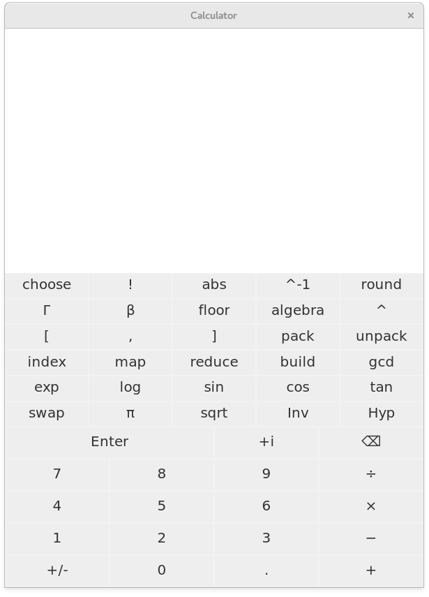

# `calculator.jl`

This is a RPN calculator, written in julia. It has a stack of plain
Julia objects (which know how to draw themselves) and buttons
correspond to julia operations. All calculations are done in terms of
`BigInt`s or `BigFloat`s or their `Complex` variants by default and
precision is currently fixed although it should not be too much work
to make this changeable. A hodgepodge collection of operations are
supported and more are added as I think of them. I aim to use
libraries implementing them rather than doing it myself.

We try to use introspection to determine whether the operation
corresponding to a button may be done however this does not always
work. For example a matching method exists to compute `besselj` with
complex bigfloats however this method throws an error immediately.
There seems to be know good way to speculatively call these existing
methods without having the potential cost (in terms of time) of them
running to completion. We would not want the calculator to attempt to
sum two vectors of 100 million items to determine whether or not they
may be summed.

A sample of operations currently included are

* Entry of integers, decimals, and complex numbers
* +, ×, ─, ÷, x^y, 1/x, absolute value
* sin, cos, tan and all hyperbolic/inverse variants
* cosec, sec, cot and all hyperbolic/invers variants (*)
* constants π, e, γ, φ
* exp, log (natural log), lg (log base 10), 10^x
* square root, cube root, square, cube
* round, floor, ciel
* choose (binomial coefficient), factorial, double factorial
* gcd, lcm
* gamma, beta
* entering vectors
  * on the stack with `[`, `,`, and `]`
  * from the stack using pack (taking _n_ elements from the stack into
    a vector)
  * by repeating an element _n_ times (build)
  * of the first _n_ natural numbers
  * unpacking the elements of a vector onto the stack
* mapping an operation over each element of a vector
* reducing a vector by putting an operation between each element (with
  associativity appropriate to the operator)
* some (still limited) algebra via [Reduce.jl](https://github.com/chakravala/Reduce.jl)

The user interface is based
on [WebRender UI](https://github.com/dan-robertson/wrui) with a small
interface to it being in `wr.jl`.

# Example

# Usage

Currently we do not build this into any kind of standalone executable. Run

    $ julia -Lsrc/calc.jl
    ...
    julia> Calc.test()

Press `escape` to exit the calculator.

# Roadmap

I want to get matrices working. The problem is that the calculator
naturally wants to encode a matrix as a vector-of-vectors. So we want
to detect that case, determine when all the subarrays are equal size
and then convert to a matrix. We possibly want to do this recursively
to convert to higher rank arrays, but there are cases when one may
want a vector of matrices of a matrix of vectors, or indeed a vector
of vectors of vectors. We should hopefully be able to do something
about this, perhaps some kind of "Put into box" operation which stops
a vector from being converted into a matrix-row when it is put inside
another vector. I also want to decide on things like dot-product. What
should happen when you have two vectors on the stack and press `*`? At
the moment, this causes an error as `*` claims the dimensions don't
work. This doesn't seem too nice to me and I think dot-product might
be nicer. Or some general "assume a vector is either a column vector
or row vector as appropriate" although this doesn't settle the
question for two vectors, should that give the inner (scalar) or outer
(tensor) product? Perhaps we should at least add a dot-product
operation.

I want to impove the way the graphics and layout works. Currently we
render the stack from the bottom up and theres no way to scroll in
either direction. I want to add scrolling but this means adding
features to my UI library. If I add scrolling then I think I should
also start doing layout top-to-bottom, but then I want the scrolling
to stay scrolled-to-bottom iff the stack is already
scrolled-to-bottom. The main rendering process will then look like
`LayoutThing` -> returns some object with some kind of dimensions, and
then take that object and do `renderLayout` to put it in a certain
place. Hopefully we would be able to cache the results of
`LayoutThing` somewhere too.

I'm still trying to get to grips with Reduce and Reduce.jl. They don't
quite seem to work the way I work but I'm really hoping I can avoid
writing my own simple (i.e. term rewriting based) algebra system in
Julia. I think I may have to though and the Julia Expr type is much
more annoying than an s-expression. It seems getting/representing
rewrite rules in Reduce is not easy.

Julia is missing some functions for `Complex{BigFloat}`s like
`besselj` and I'm not sure how much work it will be to make these
correct. I wonder if I might want to switch to a different
representation for decimals.

I think rational numbers would probably be a nice addition. Adding more
ways to input things is a bit of a pain still.

I'd also like to add types for intervals, and a sort of error-form
like in GNU Calc (a part of Emacs). There are several libraries for
intervals in Julia, largely geared towards small intervals for keeping
track of errors and determining the smallest interval containing the
image of another interval through various functions. There are also
libraries for midpoint-radius (i.e. ball) arithmetic but these are
also focused on being equivalent to interval arithmetic (so you get
problems if you do `1 / (0.5 +/- 0.5)`) whereas we would like to do
something more like: if `x = a +/- b` then `f(x) = f(a) +/- b'` where
`b'` is chosen under the assumption that if `x` is normally
distributed with mean `a` and standard deviation `b`, and `b` is
reasonably small and `f` is suitably behaved locally then `b'` should
approximately be the standard deviation of `f(x)`. Thus we would
ignore discontinuities under the assumption that if `x` comes from the
real world then it would be always land on the same side of a big
discontinuity.

I want to get integration with some big Julia packages like
differentialEquations.jl. I'm a bit hesitant to do this though because
I'm not sure that the Reduce based representation of symbolic
expressions is going to be suitable enough.
